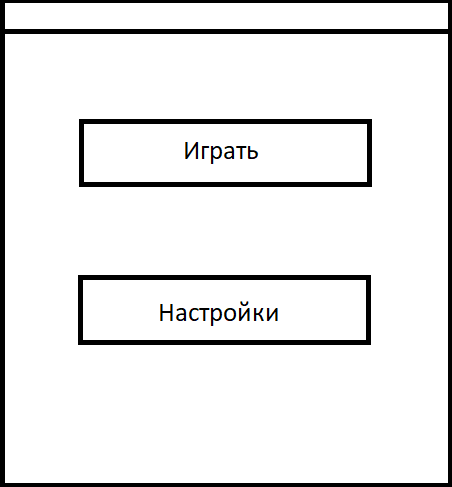

# Требования к проекту checkers_game

# <h1>1 Введениe</h1>

 Игра Шашки – логическая игра для двух игроков, заключающаяся в передвижении определённым образом фишек-шашек по клеткам шашечной доски. Цель игры — взять все шашки соперника.

Программа состоит из:
<ol> 
<li>
Основное меню программы. Данное окно создается сразу после запуска приложения, служит для навигации по основным модулям программы, а также выхода из неё.
</li>
<li>
Окно настроек. Данное окно создаётся сразу после выбора соответствующего пункта основного меню программы. Данное окно служит для настроек внешнего вида игрового объекта шашка, а именно выбора короны для “дамки”.
</li>
<li>
Окно игры одного пользователя против другого пользователя. Данное окно создаётся сразу после выбора соответствующего пункта основного меню программы. Данное окно служит для игры одного пользователя с другим пользователем, где один пользователь играет за белые шашки, а другой за черные шашки.
</li>
</ol>

# <h1>2 Требования пользователя </h1>
<h2>2.1 Программные интерфейсы </h2>

Графическая библиотека SFML содержит следующие модули: System, Window, Graphics, Audio и Network.

<ol>

<li>Модуль System является основным модулем, без которого работа всех прочих невозможна. В нём осуществляется управление временем и потоками, реализованы такие основополагающие классы как:</li>

<ul>
<li>
sfml_string для работы со строками.
</li>
<li>
Vector2 и Vector3 для хранения двумерных и трёхмерных векторов.
</li>
<li>
FileInputStream для работы с файлами.
</li>
</ul>

<li>Модуль Window необходим для работы с оконными приложениями, созданием окон и взаимодействием с пользователем посредством их. Этот модуль содержит в себе классы:</li>

<ul>
<li>
RenderWindow – используется для создания окна, а также обработку пользовательского ввода и отображения элементов интерфейса.
</li>
<li>
Event – событие, которое можно получить вызовом метода pollevent класса RenderWindow.
</li>
<li>
VideoMode – служит для задания характеристик окна, таких как, например, ширина и высота.
</li>
</ul>

<li>Модуль Graphics специально оптимизирован для работы с двумерной графикой. Данный модуль содержит в себе такие классы как:</li>

<ul>
<li>
Image – предназначен для работы с изображениями.
</li>
<li>
Font – предназначен для работы с пользовательскими шрифтами.
</li>
<li>
RectangleShape – предназначен для создания, изменения и отображения на экран прямоугольных форм.
</li>
</ul>

<li>Модуль Audio используется для работы со звуком. Данный модуль содержит в себе такие классы как:</li>

<ul>
<li>
Music – предназначен для воспроизведения из аудиофайла потоковой музыки.
</li>
<li>
Sound - предназначен для работы с обычным звуком, который можно воспроизводить в звуковой среде.
</li>
</ul>

<li>Модуль Network предназначен для работы с TCP и UDP сокетами (межсетевыми протоколами), HTTP и FTP протоколами.</li>

</ol>

<h2> 2.2 Интерфейс пользователя</h2>

В данном приложении пользователь будет взаимодействовать с приложением только при помощи мышки компьютера. После запуска приложения будет открыто игровое меню данного приложения которое будет содержать две кнопки для выбора дальнейших действий пользователя: “Игра с другом” и “Настройки”(рис. 1).

Рисунок 1 - Меню игры

При наведении курсора мыши на кнопку, она подсветится, тем самым акцентируя внимание пользователя на пункте меню игры которое он собирается выбрать. В пункте меню “Настройки” пользователю будет предоставлена возможность выбрать корону для дамки. В этом окне перед пользователем появятся две дамки с наборами корон изображенных на них(рис. 2).
 

Рисунок 2 - окно настройки

После выбора пользователем пункта меню “Игра с другом” пользователь перейдет в новое окно. В котором будет проходить сам игровой процесс. В ходе игры при нажатии на шашку будет происходить подсветка возможных её ходов. Будет присутствовать информация о том чей сейчас ход и как управлять игрой,кнопка чтения правил игры, при нажатии на которую откроется окошко с правилами, и также а также кнопка “Сдаться”. Данное окно представленно на рисунке 3.

Рисунок 3 - игра с другом

 
<h2> 2.3 Характеристики пользователей</h2>

Данное приложение рассчитано на пользователей любого возраста, любого уровня образования и с минимальным уровнем владения ПК. Но стоит отметить, что оно требует наличие минимальных знаний игры, но при этом не требует наличие опыта игры.

<h2> 2.4 Предположения и зависимости</h2>

Так как приложение компьютерное и не требует интернет соединения, то ограничений в использовании данного приложения нету.

# <h1>3 Системные требования</h1>
<h2> 3.1 Функциональные требования</h2>
<ol>
<li>
Качественное оформление приложения, включающее в себя понятный пользовательский интерфейс, красивые текстуры и подходящая цветовая гамма;
</li>
<li>
Наличие возможности играть локально с другим игроком;
</li>
<li>
Наличие возможности графических настроек шашек ранга “дамка”;
</li>
<li>
Адекватная реакция приложения на различные ненормальные ситуации;
</li>
</ol>
<h2> 3.2 Нефункциональные требования</h2>

Приложение будет располагаться локально и соответственно, не требует повышенной степени безопасности. Для целостности работы приложения необходима защита данных приложения от несанкционированных действий, т.к. удаление какого либо файла из папки приложения приведет к критическим ошибкам приложения. Приложение будет работать только на ПК с операционной системой Windows.

